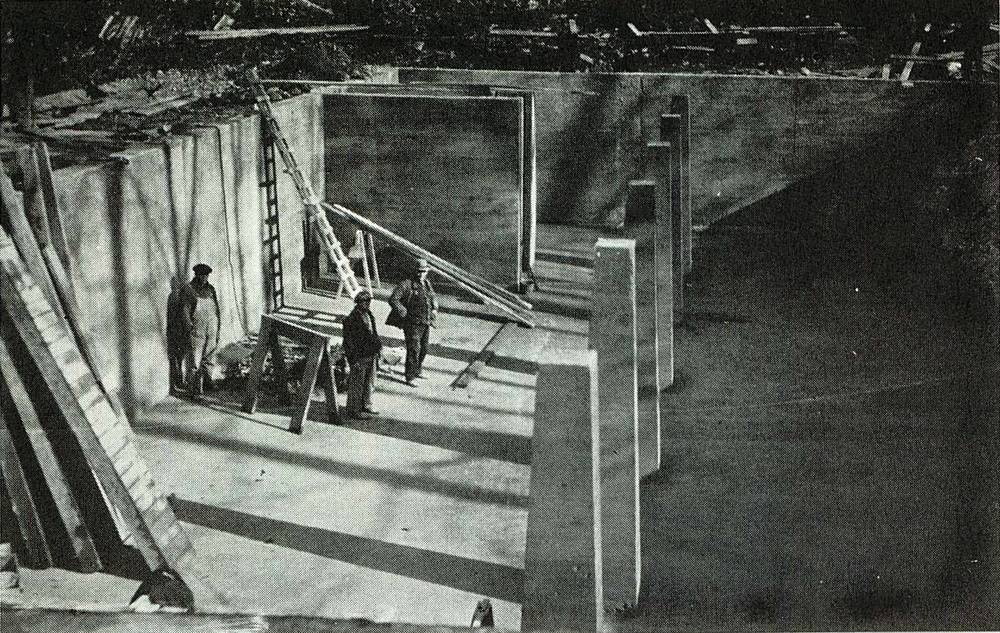
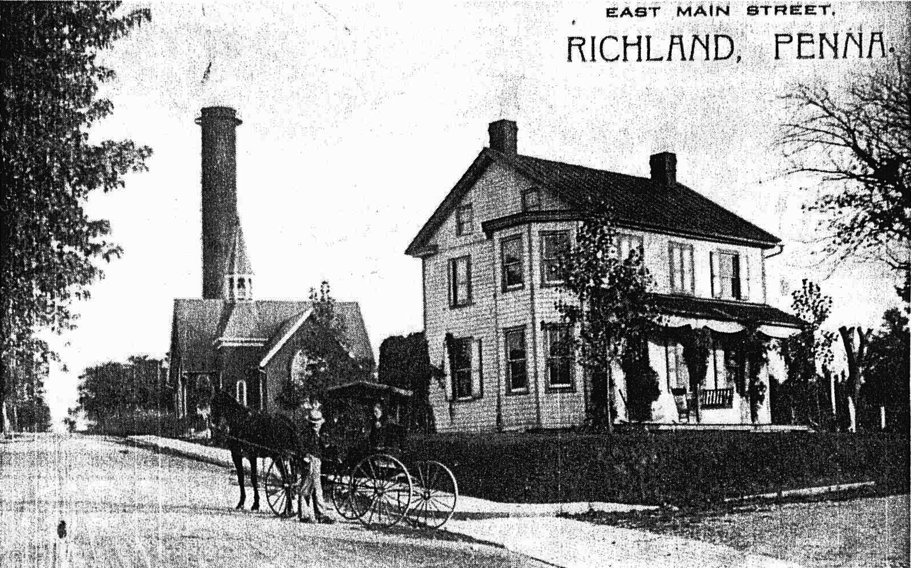
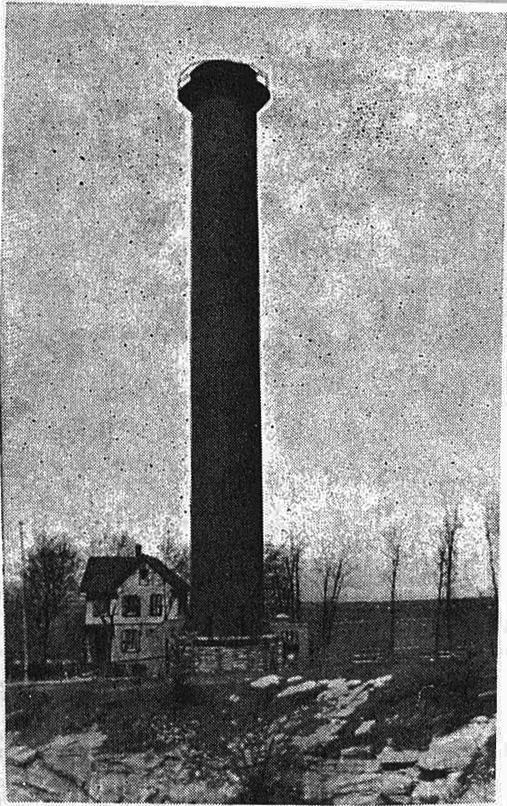

# Water Company

  <i class="fa fa-exclamation-circle alert-primary" aria-hidden="true"></i>
  Effective second quarter 2019 Water Rates will change to $60.00 Fee 
  (includes no gallons), plus an additional $5.00 per 1,000 gallons used.

Every year the Richland Borough has to send out a Consumer Confidence Report (CCR) for our water company.

See the 2015 [CCR](./files/2015CCR.pdf) here

See the 2016 [CCR](./files/2016CCR.pdf) here

See the 2017 [CCR](./files/2017CCR.pdf) here

See the 2018 [CCR](./files/2018CCR.pdf) here

## History of the Richland Water Company

May 25, 1888 the first public meeting was held in the schoolhouse in Richland regarding the town's water problem. At that time there were five to seven reliable wells in the entire town. These wells were used for drinking by the entire town; cisterns were used for other purposes. When there was high water, the wells became dirty and there was considerable sickness. Isaac Kegerreis, a Notary Public, called the first meeting to order and was elected temporary chairman.

The organization of the "Richland Water Company" occurred on June 15, 1888 with Dr. Joseph D. Zimmerman, President. The company collected money by issuing stocks valued at $10 each. December 7, 1888 the rules and by-laws were drawn up for the water company.

The first great problem was finding a source of water supply. The first plan was to pump water from the Smaltz farm spring near the Tulpehocken Creek to a tank on the West End of Richland. However, on August 15, 1888, a large spring was located in the South Mountain above the village of Stricklerstown, 350 feet above the Borough. The committee decided to build a reservoir in the area and pipe the water, by gravity flow, to Richland.

While excavating the spring damage was done and a good second spring was located on the land of Benjamin Kurtz. It was located at the base of two mountain ridges and was suitable for natural retaining of the spring. The reservoir was completed September 26, 1888. The rate of pay for the workmen was contracted at 10 cents per hour.

The route of the pipeline was a straight line from the reservoir to the main street and passed through landowners. The land owners asked for damages caused by trespasses of the company such as destruction of woodland and loss of water supply. Some claims were settled easily but other claims were unreasonable and would not be settled until many years later.

By November 14, 1888, the first section of pipe was laid from the intersection of Main and Linden Streets to the house of James Ream, 800 feet away. When the pipeline was finished to the railroad crossing, a large number of citizens gathered for the demonstration. The test was satisfactory and the pressure was 160 pounds per square inch, which burst the canvas hose in several places.

As the main line was extended and water users added, the problem of tremendous pressure was intolerable. Numerous complaints were made to the company of faucets wearing out and leaking large amount of water.

In January 1891 a provision was made for the installation of fire plugs. The citizens were responsible for the installation and repair of the plugs.

In 1892 a pressure gauge was installed in the main line on the Richland/Sheridan Road. In 1894 a pressure valve was put in the line near the house of James Ream. When the pressure became too great, the regulator would release the water into the quarry across the street from the Ream house. In winter it provided a place to ice skate.

Early in 1904 Richland recognized the need for a larger water supply. A special meeting was called, on April 16, 1904, and the directors decided, upon vote of the stockholders, to build a standpipe to store water and equalize the water pressure.

J.M. Cameron, of Philadelphia, engineered the project. J.K. Petty, of Lebanon Boiler Works, submitted the lowest bid of $2,560. The standpipe was located on East Main Street, one- fourth mile from the railroad siding and 30 feet from the roadway. The project was to be completed in 6 weeks.

The standpipe was called one of Richland's "greatest assets" and became the center of attraction for young men to display their courage and daring. Many climbed up the ladder and strolled around the platform. Rumors have it that one young man used to practice gymnastics by walking around the rail on the platform of the standpipe, which was over 100 feet off the ground! He also hung from the rail by his feet, but as he was descending the ladder one day, he looked up and saw that the pipe of the rail had come apart so that ended his stunts.

The Richland Water company sold the entire system, to the Borough of Richland, March 7, 1914, for $10,800. Land damages had to be settled and it was agreed that all land owners along the former Little Gap Stream should be supplied with water for $1 per year for the first 15 years and $2 per year thereafter. This agreement became an unbearable burden on the borough water consumers who were paying for the entire system.

In 1972, action was taken by the Richland Borough Council, to petition the Public Utility Commission to approve the increase in water rates to the consumers outside the borough limits.

Over the years the borough made a number of significant improvements to the water system. In July 1914 a new, larger reservoir was built a short distance from the original reservoir. The three inch main water line was replaced by an eight inch cast iron line and six inch distribution line. This project was accomplished during the early 1930's by the W.P.A. A pressure reducing valve was installed along Spayds' Lane, which reduced and stabilized the consumer's service line.

After several years of being out of service, the standpipe was removed, in August of 1946, by contractor Paul E. Barry.

Due to a water shortage emergency in December of 1965, where the spring was reduced to a trickle and Well No. 1 went dry in one day, the water stored in the reservoir depleted to 18 inches or 30,000 gallons. An emergency water line was laid from the water supply of Lee Eck, Krystal Klear Trout Lake, to the reservoir. Many concerned citizens worked side by side in laying 7,000 feet of steel pipe that was supplied by the Civil Defense Dept in Mechanicsburg, In a few short days the water level rose. The emergency line was used only seven and one half hours of actual pumping, from Eck's water supply.

The emergency of 1965 hastened the investigation and implementation of Well No. 4, along Spayds' Lane, which was put into service in February 1968. Every well drilled by the Richland Water Company was the direct result of droughts, which created a "scare" to borough residents and councilmen.

System improvements to improve distribution, stabilize pressure and improve fire protection include the installation of a water line under the Reading railroad roadbed in 1973, the relocation of the pressure reducing valves in the borough boundary in 1971, and looping of all blind ends within the system.

Today the borough-owned water facility, sitting in the South Mountain three miles southeast of town, is an outstanding facet of the borough. The spring flow is supplemented by four wells. The first three wells are located in the same general area as the reservoir; the fourth well is located downstream in the borough, a few yards away from Spayds' Lane.

A total of 17,500 feet of eight-inch pipe transmits water from the reservoir to Linden Street. The eight inch pipe branches into six-inch distribution lines at Linden and Main Streets. The length of borough distribution pipe is about 30,000 feet.

Fire protection is also part of the service of the Richland Borough Water Company. More than 52 fire hydrants are located within the borough, approximately 500-600 feet apart, as well as along the main line for protection of Stricklerstown residents and farms farther downstream.

Presently the Richland Borough Water Company serves 632 customers, 25 of those being outside the borough limits. Recent improvements to the water system include a standby generator and new water treatment facilities.

---

**Information taken from "Our Town USA, Richland, Pennsylvania" published in 1976 by the Richland Bi-Centennial Committee Editors Shirley Weinhold and Ned Shanaman**

